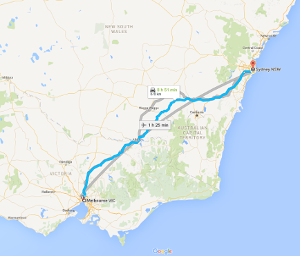
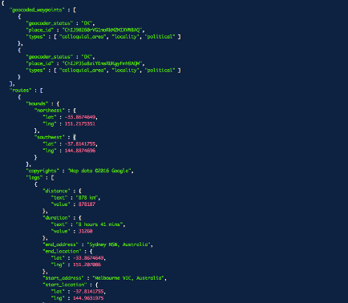
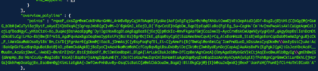

## Google Directions API

[**Google Maps**](http://www.google.com/maps) allows users to find directions between locations.

The [**Google Maps Directions API**](https://developers.google.com/maps/documentation/directions/) is a service available to developers that calculates directions between locations, and outputs the data as **JSON**.

The **googleway** package allows R users to find a route between two locations, and decode the 'polyline' sections of the outputs, into a `data.frame` of latitude and longitude coordinates that represent all the waypoints of the directions.


## Example

Searching Google Maps for directions from Melbourne to Sydney generates the route:



The same query using the developers API generates the data in JSON



This result can be returned using the `get_route()` function. 

Note you can return the output as **JSON** or a **data.frame**.

```
library(googleway)

## you will need a valid Google Directions Developers API key
df <- get_route(origin = "Melbourne, Australia",
                destination = "Sydney, Australia",
                key = key,
                mode = "driving",
                output_format = "data.frame")
```

The data used to draw the route is the **overview_polyline**



whichc is located in `df$routes$overview_polyline$points`. 

```
df$routes$overview_polyline$points
# [1] "rqxeF_cxsZgr@xmCekBhMunGnWc_Ank@vBpyCqjAfbAqmBjXydAe{AoF{oEgTqjGur@ch@qfAhUuiCww@}kEtOepAtdD{dDf~BsgIuj@}tHi{C{bGg{@{rGsmG_bDbW{wCuTyiBajBytF_oAyaI}K}bEkqA{jDg^epJmbB{gC}v@i~D`@gkGmJ_kEojD_O{`FqvCetE}bGgbDm_BqpD}pEqdGiaBo{FglEg_Su~CegHw`Cm`Hv[mxFwaAisAklCuUgzAqmCalJajLqfDedHgyC_yHibCizK~Xo_DuqAojDshAeaEpg@g`Dy|DgtNswBcgDiaAgEqgBozB{jEejQ}p@ckIc~HmvFkgAsfGmjCcaJwwD}~AycCrx@skCwUqwN{yKygH}nF_qAgyOep@slIehDcmDieDkoEiuCg|LrKo~Eb}Bw{Ef^klG_AgdFqvAaxBgoDeqBwoDypEeiFkjBa|Ks}@gr@c}IkE_qEqo@syCgG{iEazAmeBmeCqvA}rCq_AixEemHszB_SisB}mEgeEenCqeDab@iwAmZg^guB}cCk_F_iAmkGsu@abDsoBylBk`Bm_CsfD{jFgrAerB{gDkw@{|EacB_jDmmAsjC{yBsyFaqFqfEi_Ei~C{yAmwFt{B{fBwKql@onBmtCq`IomFmdGueD_kDssAwsCyqDkx@e\\kwEyUstC}uAe|Ac|BakGpGkfGuc@qnDguBatBot@}kD_pBmmCkdAgkB}jBaIyoC}xAexHka@cz@ahCcfCayBqvBgtBsuDxb@yiDe{Ikt@c{DwhBydEynDojCapAq}AuAksBxPk{EgPgkJ{gA}tGsJezKbcAcdK__@uuBn_AcuGsjDwvC_|AwbE}~@wnErZ{nGr_@stEjbDakFf_@clDmKkwBbpAi_DlgA{lArLukCBukJol@w~DfCcpBwnAghCweA}{EmyAgaEbNybGeV}kCtjAq{EveBwuHlb@gyIg\\gmEhBw{G{dAmpHp_@a|MsnCcuGy~@agIe@e`KkoA}lBspBs^}sAmgIdpAumE{Y_|Oe|CioKouFwuIqnCmlDoHamBiuAgnDqp@yqIkmEqaIozAohAykDymA{uEgiE}fFehBgnCgrGmwCkiLurBkhL{jHcrGs}GkhFwpDezGgjEe_EsoBmm@g}KimLizEgbA{~DwfCwvFmhBuvBy~DsqCicBatC{z@mlCkkDoaDw_BagA}|Bii@kgCpj@}{E}b@cuJxQwkK}j@exF`UanFzM{fFumB}fCirHoTml@CoAh`A"
```


Having retreived the polyline, we can now decode it

```{r}
polyline <- "rqxeF_cxsZgr@xmCekBhMunGnWc_Ank@vBpyCqjAfbAqmBjXydAe{AoF{oEgTqjGur@ch@qfAhUuiCww@}kEtOepAtdD{dDf~BsgIuj@}tHi{C{bGg{@{rGsmG_bDbW{wCuTyiBajBytF_oAyaI}K}bEkqA{jDg^epJmbB{gC}v@i~D`@gkGmJ_kEojD_O{`FqvCetE}bGgbDm_BqpD}pEqdGiaBo{FglEg_Su~CegHw`Cm`Hv[mxFwaAisAklCuUgzAqmCalJajLqfDedHgyC_yHibCizK~Xo_DuqAojDshAeaEpg@g`Dy|DgtNswBcgDiaAgEqgBozB{jEejQ}p@ckIc~HmvFkgAsfGmjCcaJwwD}~AycCrx@skCwUqwN{yKygH}nF_qAgyOep@slIehDcmDieDkoEiuCg|LrKo~Eb}Bw{Ef^klG_AgdFqvAaxBgoDeqBwoDypEeiFkjBa|Ks}@gr@c}IkE_qEqo@syCgG{iEazAmeBmeCqvA}rCq_AixEemHszB_SisB}mEgeEenCqeDab@iwAmZg^guB}cCk_F_iAmkGsu@abDsoBylBk`Bm_CsfD{jFgrAerB{gDkw@{|EacB_jDmmAsjC{yBsyFaqFqfEi_Ei~C{yAmwFt{B{fBwKql@onBmtCq`IomFmdGueD_kDssAwsCyqDkx@e\\kwEyUstC}uAe|Ac|BakGpGkfGuc@qnDguBatBot@}kD_pBmmCkdAgkB}jBaIyoC}xAexHka@cz@ahCcfCayBqvBgtBsuDxb@yiDe{Ikt@c{DwhBydEynDojCapAq}AuAksBxPk{EgPgkJ{gA}tGsJezKbcAcdK__@uuBn_AcuGsjDwvC_|AwbE}~@wnErZ{nGr_@stEjbDakFf_@clDmKkwBbpAi_DlgA{lArLukCBukJol@w~DfCcpBwnAghCweA}{EmyAgaEbNybGeV}kCtjAq{EveBwuHlb@gyIg\\gmEhBw{G{dAmpHp_@a|MsnCcuGy~@agIe@e`KkoA}lBspBs^}sAmgIdpAumE{Y_|Oe|CioKouFwuIqnCmlDoHamBiuAgnDqp@yqIkmEqaIozAohAykDymA{uEgiE}fFehBgnCgrGmwCkiLurBkhL{jHcrGs}GkhFwpDezGgjEe_EsoBmm@g}KimLizEgbA{~DwfCwvFmhBuvBy~DsqCicBatC{z@mlCkkDoaDw_BagA}|Bii@kgCpj@}{E}b@cuJxQwkK}j@exF`UanFzM{fFumB}fCirHoTml@CoAh`A"

library(googleway)
df <- decode_pl(polyline)
head(df)
```

```{r}

# library(leaflet)
# 
# leaflet(df) %>%
#   addTiles() %>%
#   addPolylines(lat = ~lat, lng = ~lon)


```


