Googleway provides access to Google Maps APIs, and the ability to plot an interactive Google Map overlayed with various layers and shapes, including markers, circles, rectangles, polygons, lines (polylines) and heatmaps. You can also overlay traffic information, transit and cycling routes.

The API functions are

* [**Directions**](https://developers.google.com/maps/documentation/directions/overview) - `google_directions()`
* [**Distance Matrix**](https://developers.google.com/maps/documentation/distance-matrix/overview) - `google_distance()`
* [**Elevation**](https://developers.google.com/maps/documentation/elevation/start) - `google_elevation()`
* [**Geocoding**](https://developers.google.com/maps/documentation/geocoding/start) - `google_geocode()`
* [**Reverse Geocoding**](https://developers.google.com/maps/documentation/geocoding/overview#ReverseGeocoding) - `google_reverse_geocode()`
* [**Places**](https://developers.google.com/maps/documentation/javascript/places#place_searches) - `google_places()`
* [**Place Details**](https://developers.google.com/maps/documentation/javascript/places#place_details) - `google_place_details()`
* [**Time zone**](https://developers.google.com/maps/documentation/timezone/get-started) - `google_timezone()`
* [**Roads**](https://developers.google.com/maps/documentation/roads/overview) - `google_snapToRoads()` and `google_nearestRoads()`

Plotting a Google Map uses the JavaScript API, and the functions used to create a map and overlays are

* [**Google Map**](https://developers.google.com/maps/documentation/javascript/overview) - `google_map()`
* [**Markers**](https://developers.google.com/maps/documentation/javascript/markers) - `add_markers()`
* [**Heatmap**](https://developers.google.com/maps/documentation/javascript/examples/layer-heatmap) - `add_heatmap()`
* [**Circles**](https://developers.google.com/maps/documentation/javascript/examples/circle-simple) - `add_circles()`
* [**Polygons**](https://developers.google.com/maps/documentation/javascript/examples/polygon-simple) - `add_polygons()`
* [**Lines**](https://developers.google.com/maps/documentation/javascript/examples/polyline-simple) - `add_polylines()`
* [**Rectangles**](https://developers.google.com/maps/documentation/javascript/examples/rectangle-simple) - `add_rectangles()`
* [**GeoJSON**](https://developers.google.com/maps/documentation/javascript/datalayer#load_geojson) - `add_geojson()`
* [**Drag & Drop GeoJSON**](https://developers.google.com/maps/documentation/javascript/examples/layer-data-dragndrop) - `add_dragdrop()`
* [**Overlays**](https://developers.google.com/maps/documentation/javascript/examples/overlay-simple) - `add_overlay()`
* [**KML**](https://developers.google.com/maps/documentation/javascript/examples/layer-kml) - `add_kml()`
* [**Bicycle routes**](https://developers.google.com/maps/documentation/javascript/examples/layer-bicycling) - `add_bicycling()`
* [**Traffic**](https://developers.google.com/maps/documentation/javascript/examples/layer-traffic) - `add_traffic()`
* [**Transit**](https://developers.google.com/maps/documentation/javascript/examples/layer-transit) - `add_transit()`

Downloading a static streetview map

* [**Street View Image**](https://developers.google.com/maps/documentation/streetview/overview) - `google_streetview()` 

There are also functions that directly open in a browser, but don't return any data

* [**Google Maps URL**](https://developers.google.com/maps/documentation/urls/get-started) - `google_map_url()`
* [**Google Maps Search**](https://developers.google.com/maps/documentation/urls/get-started) - `google_map_search()`
* [**Google Maps Directions**](https://developers.google.com/maps/documentation/urls/get-started) - `google_map_directions()`
* [**Google Maps Panorama**](https://developers.google.com/maps/documentation/urls/get-started) - `google_map_panorama()`


Finally, the package includes the helper functions, `encode_pl()` and `decode_pl()` for encoding and decoding polylines.

## API Key

To use most of the functions in this package you will need a valid **API KEY** ([follow instructions here to get a key](https://developers.google.com/maps/documentation/javascript/overview)) for the API you wish to use. The same API key can be used for all the functions, but you need to register it with each API first. 

The exceptions to this are the functions that don't return any data

- Google Maps URL
- Google Maps Search
- Google Maps Directions
- Google Maps Panorama

### Setting / Using keys

All the API functions have a `key` argument which you can use to provide your API key. Alternatively, you can use `set_key()` to set the key once, and make it available for all further API calls. 

If you use one key for all API calls you can just provide the `key` argument (it will automatically get set as your default key).

If you use many different keys, you can specify which API they are for in the `api` argument.

```{r}
library(googleway)
## not specifying the api will add the key as your 'default'
key <- "my_api_key"
set_key(key = key)
google_keys()

```


```{r}
## specifying the specific API will only make that key available for that API.
clear_keys() ## clear any previously set keys
key <- "my_api_key"
set_key(key = key, api = "directions")
google_keys()
```


## API Use

Google's [API pricing and plans](https://mapsplatform.google.com/pricing/) contains the most up-to-date information on their use and restrictions. 

For the free tier this is 2,500 web-service API requests (e.g., geocoding, directions, distances, etc) per day (the places API is slightly different), and 25,000 map loads per day.

## Common use cases

Common use-cases for R users are where you might have a data.frame of

- addresses for which you require coordinates (`google_geocode()`)
- coordinates for which you want the address (`google_reverse_geocode()`)
- coordinate pairs for which you want the directions between them (`google_directions()`)

In these cases Google's API can only accept one request at a time. Therefore it's not possible to 'vectorise' these functions as they have to operate one row at a time. 

The solution, therefore, will be to write some sort of loop to iterate over each row of the data.frame. 

An exaple (taken from user @Jazzurro's [answer on StackOverflow](https://stackoverflow.com/a/47966286/5977215)) being where you have 3 pairs of coordinates, and you want to find the route (polyline) between each pair. 

In this example they used an `lapply` to iterate over the rows, but any looping mechanism would have worked as well.

```
library(googleway)

mydf <- data.frame(region = 1:3,
                   from_lat = 41.8674336,
                   from_long = -87.6266382,
                   to_lat = c(41.887544, 41.9168862, 41.8190937),
                   to_long = c(-87.626487, -87.64847, -87.6230967))

mykey <- "your_api_key"

pls <- lapply(1:nrow(mydf), function(x){

    foo <- google_directions(origin = unlist(mydf[x, 2:3]),
                             destination = unlist(mydf[x, 4:5]),
                             #key = mykey,
                             mode = "driving",
                             simplify = TRUE)

    ## Decode the polyline into lat/lon coordinates
    pl <- decode_pl(foo$routes$overview_polyline$points)

    return(pl)
})

str(pls)

List of 3
 $ :'data.frame':	46 obs. of  2 variables:
  ..$ lat: num [1:46] 41.9 41.9 41.9 41.9 41.9 ...
  ..$ lon: num [1:46] -87.6 -87.6 -87.6 -87.6 -87.6 ...
 $ :'data.frame':	142 obs. of  2 variables:
  ..$ lat: num [1:142] 41.9 41.9 41.9 41.9 41.9 ...
  ..$ lon: num [1:142] -87.6 -87.6 -87.6 -87.6 -87.6 ...
 $ :'data.frame':	72 obs. of  2 variables:
  ..$ lat: num [1:72] 41.9 41.9 41.9 41.9 41.9 ...
  ..$ lon: num [1:72] -87.6 -87.6 -87.6 -87.6 -87.6 ...
  
```


## Result accessors

For the API calls that return data, I have provided some helper functions to access specific data points returned from the API calls. The full list is given in the help file `?access_result`. Examples of its use is demonstrated throughout this vignette.

If there is a specific data point you would like added to the function, please [file an issue](https://github.com/SymbolixAU/googleway/issues) on my github page

---

## Google Directions API

[**Google Maps**](https://www.google.com/maps) allows users to find directions between locations.

The [**Google Maps Directions API**](https://developers.google.com/maps/documentation/directions/overview) is a service available to developers that calculates directions between locations.

Searching Google Maps for directions from Melbourne to Sydney generates the route:

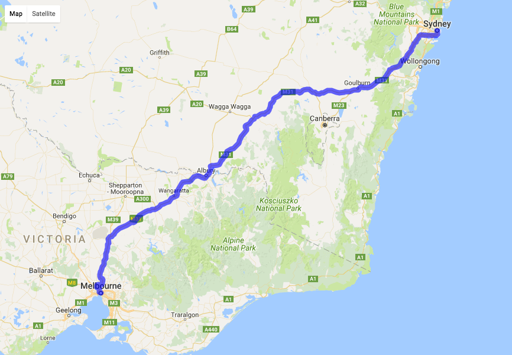

The same query using the developers API generates the data in JSON

```
{
   "geocoded_waypoints" : [
      {
         "geocoder_status" : "OK",
         "place_id" : "ChIJ90260rVG1moRkM2MIXVWBAQ",
         "types" : [ "colloquial_area", "locality", "political" ]
      },
      {
         "geocoder_status" : "OK",
         "place_id" : "ChIJP3Sa8ziYEmsRUKgyFmh9AQM",
         "types" : [ "colloquial_area", "locality", "political" ]
      }
   ],
   "routes" : [
      {
         "bounds" : {
            "northeast" : {
               "lat" : -33.8660005,
               "lng" : 151.2176931
            },
            "southwest" : {
               "lat" : -37.8136598,
               "lng" : 144.8875036
            }
         },
         "copyrights" : "Map data ©2017 Google",
         "legs" : [
            {
               "distance" : {
                  "text" : "878 km",
                  "value" : 878208
               },
               "duration" : {
                  "text" : "8 hours 44 mins",
                  "value" : 31447
               },
               "end_address" : "Sydney NSW, Australia",
               "end_location" : {
                  "lat" : -33.8689894,
                  "lng" : 151.2091978
               },
               "start_address" : "Melbourne VIC, Australia",
               "start_location" : {
                  "lat" : -37.8136598,
                  "lng" : 144.9629147
               },
    ... etc
    
```

This result can be returned in R using the `google_directions()` function. By default the result will be coerced to the simplest `R` structure possible using `jsonlite::fromJSON()`. If you want the result in JSON set `simplify = FALSE`.

```
library(googleway)

key <- "your_api_key"
df <- google_directions(origin = "Melbourne, Australia",
                        destination = "Sydney, Australia",
                        key = key,
                        mode = "driving",
                        simplify = TRUE)
```

The data used to draw the route on the map is the **overview_polyline**. This string represents a sequence of lat/lon pairs, encoded using a lossy compression algorithm (https://developers.google.com/maps/documentation/utilities/polylinealgorithm) that allows you to store the series of coordinates as a single string. 

You can extract the polyline manually 

```
pl <- df$routes$overview_polyline$points
```

Or use the `direction_polyline()` accessor

```
pl <- direction_polyline(df)
pl
# [1] "rqxeF_cxsZgr@xmCekBhMunGnWc_Ank@vBpyCqjAfbAqmBjXydAe{AoF{oEgTqjGur@ch@qfAhUuiCww@}kEtOepAtdD{dDf~BsgIuj@}tHi{C{bGg{@{rGsmG_bDbW{wCuTyiBajBytF_oAyaI}K}bEkqA{jDg^epJmbB{gC}v@i~D`@gkGmJ_kEojD_O{`FqvCetE}bGgbDm_BqpD}pEqdGiaBo{FglEg_Su~CegHw`Cm`Hv[mxFwaAisAklCuUgzAqmCalJajLqfDedHgyC_yHibCizK~Xo_DuqAojDshAeaEpg@g`Dy|DgtNswBcgDiaAgEqgBozB{jEejQ}p@ckIc~HmvFkgAsfGmjCcaJwwD}~AycCrx@skCwUqwN{yKygH}nF_qAgyOep@slIehDcmDieDkoEiuCg|LrKo~Eb}Bw{Ef^klG_AgdFqvAaxBgoDeqBwoDypEeiFkjBa|Ks}@gr@c}IkE_qEqo@syCgG{iEazAmeBmeCqvA}rCq_AixEemHszB_SisB}mEgeEenCqeDab@iwAmZg^guB}cCk_F_iAmkGsu@abDsoBylBk`Bm_CsfD{jFgrAerB{gDkw@{|EacB_jDmmAsjC{yBsyFaqFqfEi_Ei~C{yAmwFt{B{fBwKql@onBmtCq`IomFmdGueD_kDssAwsCyqDkx@e\\kwEyUstC}uAe|Ac|BakGpGkfGuc@qnDguBatBot@}kD_pBmmCkdAgkB}jBaIyoC}xAexHka@cz@ahCcfCayBqvBgtBsuDxb@yiDe{Ikt@c{DwhBydEynDojCapAq}AuAksBxPk{EgPgkJ{gA}tGsJezKbcAcdK__@uuBn_AcuGsjDwvC_|AwbE}~@wnErZ{nGr_@stEjbDakFf_@clDmKkwBbpAi_DlgA{lArLukCBukJol@w~DfCcpBwnAghCweA}{EmyAgaEbNybGeV}kCtjAq{EveBwuHlb@gyIg\\gmEhBw{G{dAmpHp_@a|MsnCcuGy~@agIe@e`KkoA}lBspBs^}sAmgIdpAumE{Y_|Oe|CioKouFwuIqnCmlDoHamBiuAgnDqp@yqIkmEqaIozAohAykDymA{uEgiE}fFehBgnCgrGmwCkiLurBkhL{jHcrGs}GkhFwpDezGgjEe_EsoBmm@g}KimLizEgbA{~DwfCwvFmhBuvBy~DsqCicBatC{z@mlCkkDoaDw_BagA}|Bii@kgCpj@}{E}b@cuJxQwkK}j@exF`UanFzM{fFumB}fCirHoTml@CoAh`A"
```


Having retrieved the polyline, you can decode it into latitude and longitude coordinates using `decode_pl()`.

```{r}
polyline <- "rqxeF_cxsZgr@xmCekBhMunGnWc_Ank@vBpyCqjAfbAqmBjXydAe{AoF{oEgTqjGur@ch@qfAhUuiCww@}kEtOepAtdD{dDf~BsgIuj@}tHi{C{bGg{@{rGsmG_bDbW{wCuTyiBajBytF_oAyaI}K}bEkqA{jDg^epJmbB{gC}v@i~D`@gkGmJ_kEojD_O{`FqvCetE}bGgbDm_BqpD}pEqdGiaBo{FglEg_Su~CegHw`Cm`Hv[mxFwaAisAklCuUgzAqmCalJajLqfDedHgyC_yHibCizK~Xo_DuqAojDshAeaEpg@g`Dy|DgtNswBcgDiaAgEqgBozB{jEejQ}p@ckIc~HmvFkgAsfGmjCcaJwwD}~AycCrx@skCwUqwN{yKygH}nF_qAgyOep@slIehDcmDieDkoEiuCg|LrKo~Eb}Bw{Ef^klG_AgdFqvAaxBgoDeqBwoDypEeiFkjBa|Ks}@gr@c}IkE_qEqo@syCgG{iEazAmeBmeCqvA}rCq_AixEemHszB_SisB}mEgeEenCqeDab@iwAmZg^guB}cCk_F_iAmkGsu@abDsoBylBk`Bm_CsfD{jFgrAerB{gDkw@{|EacB_jDmmAsjC{yBsyFaqFqfEi_Ei~C{yAmwFt{B{fBwKql@onBmtCq`IomFmdGueD_kDssAwsCyqDkx@e\\kwEyUstC}uAe|Ac|BakGpGkfGuc@qnDguBatBot@}kD_pBmmCkdAgkB}jBaIyoC}xAexHka@cz@ahCcfCayBqvBgtBsuDxb@yiDe{Ikt@c{DwhBydEynDojCapAq}AuAksBxPk{EgPgkJ{gA}tGsJezKbcAcdK__@uuBn_AcuGsjDwvC_|AwbE}~@wnErZ{nGr_@stEjbDakFf_@clDmKkwBbpAi_DlgA{lArLukCBukJol@w~DfCcpBwnAghCweA}{EmyAgaEbNybGeV}kCtjAq{EveBwuHlb@gyIg\\gmEhBw{G{dAmpHp_@a|MsnCcuGy~@agIe@e`KkoA}lBspBs^}sAmgIdpAumE{Y_|Oe|CioKouFwuIqnCmlDoHamBiuAgnDqp@yqIkmEqaIozAohAykDymA{uEgiE}fFehBgnCgrGmwCkiLurBkhL{jHcrGs}GkhFwpDezGgjEe_EsoBmm@g}KimLizEgbA{~DwfCwvFmhBuvBy~DsqCicBatC{z@mlCkkDoaDw_BagA}|Bii@kgCpj@}{E}b@cuJxQwkK}j@exF`UanFzM{fFumB}fCirHoTml@CoAh`A"

df <- decode_pl(polyline)
head(df)
```

And, of course, to encode a series of lat/lon coordinates you use `encode_pl()`

```{r}

encode_pl(lat = df$lat, lon = df$lon)

```


---

## Google Distance API

The [**Google Maps Distance API**](https://developers.google.com/maps/documentation/distance-matrix/overview) is a service that provides travel distance and time for a matrix of origins and destinations.


Finding the distances between Melbourne Airport, the MCG, a set of coordinates (-37.81659, 144.9841), to Portsea, Melbourne.

```
df <- google_distance(origins = list(c("Melbourne Airport, Australia"),
                                     c("MCG, Melbourne, Australia"),
                                     c(-37.81659, 144.9841)),
                      destinations = c("Portsea, Melbourne, Australia"),
                      key = key)

head(df)
$destination_addresses
[1] "Melbourne Rd, Victoria, Australia"

$origin_addresses
[1] "Melbourne Airport (MEL), Departure Dr, Melbourne Airport VIC 3045, Australia"
[2] "Jolimont Station, Wellington Cres, East Melbourne VIC 3002, Australia"       
[3] "176 Wellington Parade, East Melbourne VIC 3002, Australia"                   

$rows
                                                        elements
1 130 km, 129501, 1 hour 38 mins, 5853, 1 hour 36 mins, 5770, OK
2 104 km, 104393, 1 hour 20 mins, 4819, 1 hour 20 mins, 4792, OK
3 104 km, 104350, 1 hour 20 mins, 4814, 1 hour 20 mins, 4788, OK

$status
[1] "OK"

```

---

## Google Elevation API

The [**Google Maps Elevation API**](https://developers.google.com/maps/documentation/elevation/start) provides elevation data for all locations on the surface of the earth, including depth locations on the ocean floor (which return negative values).

Finding the elevation of 20 points between the MCG, Melbourne and the beach at Elwood, Melbourne

```
google_elevation(df_locations = data.frame(lat = c(-37.81659, -37.88950),
                                           lon = c(144.9841, 144.9841)),
                  location_type = "path",
                  samples = 20,
                  key = key,
                  simplify = TRUE)
                       
$results
    elevation location.lat location.lng resolution
1  20.8899250    -37.81659     144.9841   9.543952
2   7.8955822    -37.82043     144.9841   9.543952
3   8.4334993    -37.82426     144.9841   9.543952
4   5.4820895    -37.82810     144.9841   9.543952
5  33.5920677    -37.83194     144.9841   9.543952
6  30.4819584    -37.83578     144.9841   9.543952
7  15.0097895    -37.83961     144.9841   9.543952
8  10.9842978    -37.84345     144.9841   9.543952
9  13.8762951    -37.84729     144.9841   9.543952
10 13.4834013    -37.85113     144.9841   9.543952
11 13.3473139    -37.85496     144.9841   9.543952
12 24.9176636    -37.85880     144.9841   9.543952
13 16.7720604    -37.86264     144.9841   9.543952
14  5.8330226    -37.86648     144.9841   9.543952
15 10.7889471    -37.87031     144.9841   9.543952
16  6.9589133    -37.87415     144.9841   9.543952
17  3.9915009    -37.87799     144.9841   9.543952
18  5.3637657    -37.88183     144.9841   9.543952
19  7.1594319    -37.88566     144.9841   9.543952
20  0.6697893    -37.88950     144.9841   9.543952

$status
[1] "OK"

```

---

## Google Timezone API

The [**Google Maps Time zone API**](https://developers.google.com/maps/documentation/timezone/get-started) provides time offset data for locations on the surface of the earth. You request the time zone information for a specific latitude/longitude pair and date. The API returns the name of that time zone, the time offset from UTC, and the daylight savings offset.

Finding the timezone of the MCG in Melbourne

```
google_timezone(location = c(-37.81659, 144.9841), 
                timestamp = as.POSIXct("2016-06-05"), 
                key = key,
                simplify = FALSE)
                
[1] "{"                                                         
[2] "   \"dstOffset\" : 0,"                                     
[3] "   \"rawOffset\" : 36000,"                                 
[4] "   \"status\" : \"OK\","                                   
[5] "   \"timeZoneId\" : \"Australia/Hobart\","                 
[6] "   \"timeZoneName\" : \"Australian Eastern Standard Time\""
[7] "}"

```

---

## Google Geocode API

The [**Google Maps Geocoding API**](https://developers.google.com/maps/documentation/geocoding/start) is a service that provides geocoding and reverse geocoding of addresses.


Finding the location details for Flinders Street Station, Melbourne

```

df <- google_geocode(address = "Flinders Street Station",
                     key = key,
                     simplify = TRUE)

df$results$formatted_address
[1] "Flinders St, Melbourne VIC 3000, Australia"

## If your search responde multiple results, you can 
## bound the search, for example

bounds <- list(c(-37.81962,144.9657),
               c(-37.81692, 144.9684))

df <- google_geocode(address = "Flinders Street Station",
                     bounds = bounds,
                     key = key,
                     simplify = TRUE)

## (in this example only one result was returned in the original call)

```

The coordinates of the location can be accessed with

```
geocode_coordinates(df)
#         lat      lng
# 1 -37.81827 144.9671
```

---

## Google Reverse Geocode API

The [**Google Maps Reverse Geocoding API**](https://developers.google.com/maps/documentation/geocoding/overview#ReverseGeocoding) is a service that converts geographic coordinates into a human-readable address.

Finding the street address for a set of coordinates, using `result_type` and `location_type` as bounding parameters:

```
df <- google_reverse_geocode(location = c(-37.81659, 144.9841),
                             result_type = c("street_address", "postal_code"),
                             location_type = "rooftop",
                             key = key,
                             simplify = TRUE)

df$results$address_components
[[1]]
          long_name        short_name                                  types
1               176               176                          street_number
2 Wellington Parade Wellington Parade                                  route
3    East Melbourne    East Melbourne                    locality, political
4          Victoria               VIC administrative_area_level_1, political
5         Australia                AU                     country, political
6              3002              3002                            postal_code

df$results$geometry
  location.lat location.lng location_type viewport.northeast.lat viewport.northeast.lng viewport.southwest.lat
1    -37.81608     144.9842       ROOFTOP              -37.81473               144.9855              -37.81743
  viewport.southwest.lng
1               144.9828

```

---

## Google Places API

The [**Google Maps Places API**](https://developers.google.com/maps/) gets data from the same database used by Google Maps and Google+ Local. Places features more than 100 million businesses and points of interest that are updated frequently through owner-verified listings and user-moderated contributions.

There are three types of search you can perform

* Nearby
* Text
* Place Details


A **Nearby** Search lets you search for places within a specified area. You can refine your search request by supplying keywords or specifying the type of place you are searching for.

A **Text** Search Service is a web service that returns information about a set of places based on a string — for example "pizza in New York" or "shoe stores near Ottawa" or "123 Main Street". The service responds with a list of places matching the text string and any location bias that has been set.

A **Place Detail** search (using `google_place_details()`) can be performed when you have a given `place_id` from one of the other three search methods.


### Text

For a **text** search you are required to provide a `search_string`

For example, here's a query for "restaurants in Melbourne"

```

res <- google_places(search_string = "Restaurants in Melbourne, Australia",
                     key = key)

## View the names of the returned restaurantes, and whether they are open or not

cbind(res$results$name, res$results$opening_hours)

                                            res$results$name open_now weekday_text
1                                               Vue de monde     TRUE         NULL
2                                                      ezard    FALSE         NULL
3                                                     MoVida     TRUE         NULL
4                           Flower Drum Restaurant Melbourne     TRUE         NULL
5                                             The Press Club    FALSE         NULL
6                                                       Maha     TRUE         NULL
7                                                  Bluestone       NA         NULL
8                                                  Chin Chin     TRUE         NULL
9                                               Taxi Kitchen     TRUE         NULL
10                                           Max on Hardware     TRUE         NULL
11                                                    Attica    FALSE         NULL
12                                       Nirankar Restaurant    FALSE         NULL
13                                                  The Mill     TRUE         NULL
14                                   The Left Bank Melbourne     TRUE         NULL
15                           The Colonial Tramcar Restaurant     TRUE         NULL
16                                      Rockpool Bar & Grill     TRUE         NULL
17 Lane Restaurant Cafe & Bar - Novotel Melbourne on Collins     TRUE         NULL
18                                          Melba Restaurant     TRUE         NULL
19                                              CUMULUS INC.     TRUE         NULL
20                                    radii restaurant & bar    FALSE         NULL

```

A single query will return 20 results per page. You can view the next 20 results using the `next_page_token` that is returned as part of the initial query.

```

res_next <- google_places(search_string = "Restaurants in Melbourne, Australia",
                          page_token = res$next_page_token,
                          key = key)
                          
cbind(res_next$results$name, res_next$results$opening_hours)

                     res_next$results$name open_now weekday_text
1  Moshi Moshi Japanese Seafood Restaurant     TRUE         NULL
2                      Grill Steak Seafood     TRUE         NULL
3                             Conservatory     TRUE         NULL
4                                    Sarti    FALSE         NULL
5                                  Tsindos     TRUE         NULL
6                 The Cerberus Beach House     TRUE         NULL
7                   Stalactites Restaurant     TRUE         NULL
8            Hanabishi Japanese Restaurant    FALSE         NULL
9                          GAZI Restaurant     TRUE         NULL
10                           Om Vegetarian    FALSE         NULL
11                           Shark Fin Inn     TRUE         NULL
12                           Om Vegetarian     TRUE         NULL
13                 The Atlantic Restaurant     TRUE         NULL
14                                  Takumi     TRUE         NULL
15                              Pei Modern       NA         NULL
16                 Bamboo House Restaurant     TRUE         NULL
17                 Byblos Bar & Restaurant     TRUE         NULL
18                              Waterfront     TRUE         NULL
19                                   No 35     TRUE         NULL
20                        Bistro Guillaume     TRUE         NULL

```

### Nearby

For a **nearby** search you are required to provide a `location` as a pair of latitude/longitude coordinates. You can refine your search by providing a keyword and / or a radius.


```
res <- google_places(location = c(-37.918, 144.968),
                    keyword = "Restaurant",
                    radius = 5000,
                    key = key)


cbind(res$results$name, res$results$opening_hours)
#                         res$results$name open_now weekday_text
# 1                              Melbourne       NA         NULL
# 2              Quest Brighton on the Bay     TRUE         NULL
# 3                         Brighton Savoy    FALSE         NULL
# 4  Caroline Serviced Apartments Brighton     TRUE         NULL
# 5      The Buckingham Serviced Apartment       NA         NULL
# 6                      Sandringham Hotel     TRUE         NULL
# 7               Indian Palace Restaurant     TRUE         NULL
# 8                       Elsternwick Park     TRUE         NULL
# 9                         Brown Cow Cafe     TRUE         NULL
# 10              Bok Choy Chinese Cuisine    FALSE         NULL
# 11                          Marine Hotel     TRUE         NULL
# 12                          Daily Planet     TRUE         NULL
# 13                         Riva St Kilda     TRUE         NULL
# 14                         New Bay Hotel     TRUE         NULL
# 15          Flight Centre North Brighton     TRUE         NULL
# 16              Vintage Cellars Brighton     TRUE         NULL
# 17                   Palace Brighton Bay     TRUE         NULL
# 18                       Brighton Toyota     TRUE         NULL
# 19                            Sportsgirl     TRUE         NULL
# 20                           Saint Kilda       NA         NULL
```

---

## Google Roads

The Google Roads API provides three functions

* [Snap To Roads](https://developers.google.com/maps/documentation/roads/snap)
* [Nearest Roads](https://developers.google.com/maps/documentation/roads/nearest)
* [Speed Limits](https://developers.google.com/maps/documentation/roads/speed-limits) (premium only)


### Snap to Roads

The snap to roads function takes up to 100 GPS points collected along a route and returns the points snapped to the most likely roads that were travelled along. 

```

df_path <- read.table(text = "lat lon
-35.27801 149.12958
-35.28032 149.12907
-35.28099 149.12929
-35.28144 149.12984
-35.28194 149.13003
-35.28282 149.12956
-35.28302 149.12881
-35.28473 149.12836
", header = T, stringsAsFactors = F)


res <- google_snapToRoads(df_path = df_path, key = key)

res$snappedPoints
  location.latitude location.longitude originalIndex                     placeId
1         -35.27800           149.1295             0 ChIJr_xl0GdNFmsRsUtUbW7qABM
2         -35.28032           149.1291             1 ChIJOyypT2hNFmsRZBtscGL0htw
3         -35.28101           149.1292             2 ChIJv5r0smlNFmsR5nunau79Fv4
4         -35.28147           149.1298             3 ChIJ601MoWlNFmsR5mvkfPp2ovA
5         -35.28194           149.1300             4 ChIJ601MoWlNFmsR5mvkfPp2ovA
6         -35.28282           149.1296             5 ChIJaUpThGlNFmsRMHWxoH7EOsc
7         -35.28313           149.1289             6 ChIJWSb8ImpNFmsRp_4JAxJFE1A
8         -35.28473           149.1283             7 ChIJtWxAZmpNFmsRlbUCkc6VtnA

```

The result includes the column `originalIndex`. This is a zero-based index that indicates which of the input coordinates has been snapped to the given `location.latitude`/`location.longitude` coordinates. So in this example, `originalIndex` 0 is the first row of `df_path`, `originalIndex` 1 is the second row of `df_path`, and so on.


### Nearest Roads

The nearest roads function takes up to 100 independent coordinates and returns the closest road segment for each point. 


```
df_points <- read.table(text = "lat lon
60.1707 24.9426
60.1708 24.9424
60.1709 24.9423", header = T)

res <- google_nearestRoads(df_points, key = key)

res$snappedPoints
  location.latitude location.longitude originalIndex                     placeId
1          60.17070           24.94272             0 ChIJNX9BrM0LkkYRIM-cQg265e8
2          60.17081           24.94271             1 ChIJNX9BrM0LkkYRIM-cQg265e8
3          60.17091           24.94270             2 ChIJNX9BrM0LkkYRIM-cQg265e8

```

---

## Google Maps

A google map can be made using the `google_map()` function. Without any data present, or no `location` value set, the map will default to Melbourne, Australia.

You can also display traffic, transit (public transport) or bicycle routes using the functions `add_traffic()`, `add_transit()` and `add_bicycling()` respectively. 

You can also include a search box in your map by using the argument `search_box = TRUE`, which allows you to search the maps just like you would when using Google Maps.

```
map_key <- "your_api_key"
google_map(key = map_key, search_box = T) %>%
  add_traffic()

```
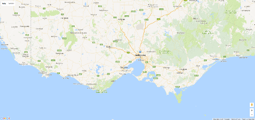


---

### Markers

Markers and circles can be used to show points on the map. 

In this example I'm using the `tram_stops` data set provided with googleway. 

You can specify a column in the data.frame to use to populate a popup `info_window` that will be displayed when clicking on a maker. The info window can display any valid HTML, as demonstrated in [this Stack Overflow answer](https://stackoverflow.com/a/39339464/5977215).


```
df <- tram_stops
df$info <- paste0("<b>Stop Name: </b>", df$stop_name)

map_key <- "your_api_key"
google_map(data = df, key = map_key) %>%
  add_markers(lat = "stop_lat", lon = "stop_lon", info_window = "info")
```

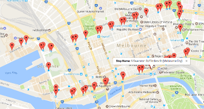

### Heatmap

You can create a heatmap using Google's [Heatlayer](https://developers.google.com/maps/documentation/javascript/examples/layer-heatmap).


```
google_map(data = tram_stops, key = map_key) %>%
  add_heatmap(lat = "stop_lat", lon = "stop_lon", option_radius = 0.0025)
```

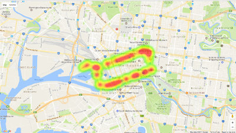


There are a few options you can configure to change how the heatmap is plotted, for example changing the colours, and weight associated with each point in the data set


```
## the colours can be any of those given by colors()
tram_stops$weight <- 1:nrow(tram_stops)

google_map(data = tram_stops, key = map_key) %>%
  add_heatmap(lat = "stop_lat", lon = "stop_lon", option_radius = 0.0025,
              weight = 'weight', 
              option_gradient = c("plum1", "purple1", "peachpuff"))

```
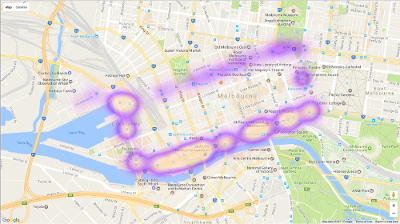


---

### Polyline

Polylines in Google Maps are formed from a set of latitude/longitude coordinates, encoded into a polyline string.

Both the `add_polylines()` and `add_polygons()` functions in googleway can plot the encoded polyline to save the amount of data set to the browser. (They can also plot coordinates, but this is often slower).

To draw a line on a map you use the `add_polylines()` function. This function takes a data.frame with at least one column of data containing the polylines, or two columns containing the series of lat/lon coordinates. 

Here we can plot the polyline we generated earlier from querying the directions from Melbourne to Sydney.

```

df <- data.frame(polyline = pl)

google_map(key = map_key) %>%
    add_polylines(data = df, polyline = "polyline", stroke_weight = 9)

```


---

### Polygon

A polygon represents an area enclosed by one or more polylines. Holes are denoted by defining an inner path wound in the opposite direction to the outer path.

To draw a polygon on a map use the `add_polygons()` function. This function takes a data.frame, where the polygons can be specified in one of three ways

* Multiple rows of latitude and longitude coordinates that specify paths, using an `id` and `pathId` value to specify the polygon that each path belongs to
* Rows of encoded polylines, using a `id` value to specify the polygon that each polyline represents
* Rows of nested polylines in a list column. Each row represents a polygon, and each polyline in the list represents the paths that make up the polygon.


The `melbourne` data set provided with `googleway` is a `data.frame` of polygons of Melbourne and the surrounding suburbs. The coordinates of the polygons are encoded in to polylines. 


```{r}

melbourne[melbourne$polygonId == 338 & melbourne$pathId %in% c(1, 2), ]

```


Plotting this data is done using `add_polygons()`


```
google_map(key = "your_api_key") %>% 
  add_polygons(data = melbourne, polyline = "polyline", fill_colour = "SA4_NAME")
```


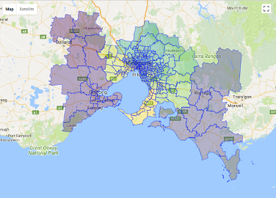


In this example I've specified the `fill_colour` to be one of the columns of the `melbourne` data set. The plotting functions in `googleway` will map the variables in the column to a given colour. The default colour scale is taken from `viridisLite::viridis()`. 

### Colours & Legend

Where applicable the map layer functions provide two arguments that you can use to plot colours

- `fill_colour` (for colouring an area)
- `stroke_colour` (for colouring a line / outline of an area)

Each of those arguments can be mapped to a column of data (as in the Polygon example), or if you want to use your own colours you can either

- specify the palette using the `palette` argument
```
google_map(key = "your_api_key") %>% 
  add_polygons(data = melbourne, polyline = "polyline", fill_colour = "SA4_NAME", palette = viridisLite::inferno)
```
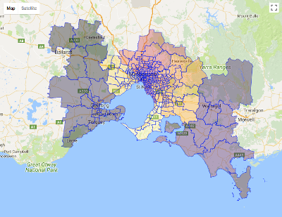

- add a column of hex colour values and supply this to the plotting function

```
colours <- RColorBrewer::brewer.pal(9, "Set1")
melbourne$randomColour <- sample(colours, size = nrow(melbourne), replace = T)
google_map(key = "your_api_key") %>% 
  add_polygons(data = melbourne, polyline = "polyline", fill_colour = "randomColour")
```
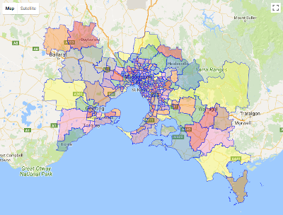


- specify a single hex colour value to either `fill_colour` or `stroke_colour` to colour all shapes the same colour

```
google_map(key = "your_api_key") %>% 
  add_polygons(data = melbourne, polyline = "polyline", fill_colour = "#FF00FF")
```
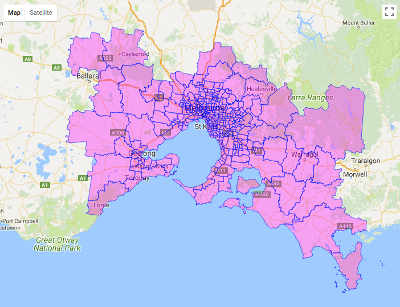

Setting `legend = TRUE` will give you a legend

```
google_map(key = "your_api_key") %>% 
  add_polygons(data = melbourne, polyline = "polyline", fill_colour = "SA4_NAME", legend = T)

```
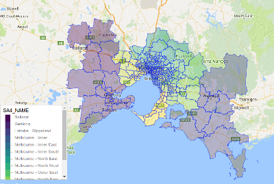


You can customise the legend by supplying any of the arguments in a list to the `legend_options` argument

- position - one of TOP_LEFT, TOP_CENTER, TOP_RIGHT, RIGHT_TOP, RIGHT_CENTER, RIGHT_BOTTOM, BOTTOM_RIGHT, BOTTOM_CENTER, BOTTOM_LEFT, LEFT_BOTTOM, LEFT_CENTER and LEFT_TOP
- css - a string of valid CSS for controlling the appearance
- title - a string to use for the title of the legend. The default is the column name mapped to the colour


If you are displaying two legends, one for `stroke_colour` and one for `fill_colour`, you can specify different options for the different colour attributes

```
legendOpts <- list(
  fill_colour = list(position = "TOP_RIGHT"),
  stroke_colour = list(position = "BOTTOM_LEFT", title = "SA3")
  )

google_map(key = "your_api_key") %>% 
  add_polygons(data = melbourne, polyline = "polyline", fill_colour = "SA4_NAME", stroke_colour = "SA3_NAME", legend = T, legend_options = legendOpts)

```
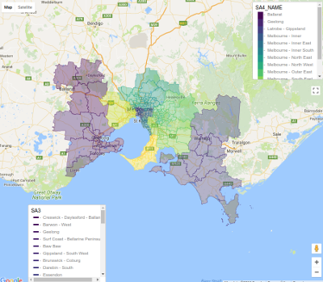


### Simple Features

`googleway` supports plotting certain geometries from `sf` objects (from `library(sf)`)

- POINT and MULTIPOINT plotted with `add_markers()` and `add_circles()`
- LINESTRING and MULTILINESTRING plotted with `add_polylines()`
- POLYGON and MULTIPOLYGON plotted with `add_polygons()`

This example uses and plots the polygons from the North Carolina data set supplied with `library(sf)`

```
library(sf)
nc <- sf::st_read(system.file("shape/nc.shp", package="sf"))

google_map(data = nc) %>%
  add_polygons()

```

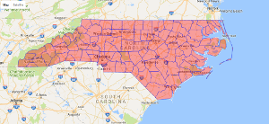

If the `sf` objects contains multiple geometries, you can also use the various `add_*` functions to add specific rows of the `sf` object. The mapping between the functions and the `sf` objects is

- `add_markers()` - POINT & MULTIPOINT
- `add_circles()` - POINT & MULTIPOINT
- `add_polylines()` - LINESTRING & MULTILINESTRING
- `add_polygons()` - POLYGON & MULTIPOLYGON

```
df <- data.frame(myId = c(1,1,1,1,1,1,1,1,2,2,2,2),
  lineId = c(1,1,1,1,2,2,2,2,1,1,1,2),
 	lon = c(-80.190, -66.118, -64.757, -80.190,  -70.579, -67.514, -66.668, -70.579, -70, -49, -51, -70),
 	lat = c(26.774, 18.466, 32.321, 26.774, 28.745, 29.570, 27.339, 28.745, 22, 23, 22, 22))

p1 <- as.matrix(df[4:1, c("lon", "lat")])
p2 <- as.matrix(df[8:5, c("lon", "lat")])
p3 <- as.matrix(df[9:12, c("lon", "lat")])

point <- sf::st_sfc(sf::st_point(x = c(df[1,"lon"], df[1,"lat"])))
multipoint <- sf::st_sfc(sf::st_multipoint(x = as.matrix(df[1:2, c("lon", "lat")])))
polygon <- sf::st_sfc(sf::st_polygon(x = list(p1, p2)))
linestring <- sf::st_sfc(sf::st_linestring(p3))
multilinestring <- sf::st_sfc(sf::st_multilinestring(list(p1, p2)))
multipolygon <- sf::st_sfc(sf::st_multipolygon(x = list(list(p1, p2), list(p3))))

sf <- rbind(
	sf::st_sf(geometry = polygon),
	sf::st_sf(geometry = multipolygon),
	sf::st_sf(geometry = multilinestring),
	sf::st_sf(geometry = linestring),
	sf::st_sf(geometry = point),
  sf::st_sf(geometry = multipoint)
)


google_map(data = sf) %>%
  add_markers() %>%
  add_polylines()

```
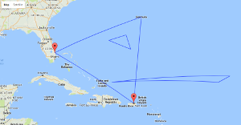


### GeoJSON

The `geo_melbourne` data set is a GeoJSON representation of a subset of the `melbourne` data set. You can use `add_geojson` to plot this data

```
google_map() %>%
  add_geojson(data = geo_melbourne)
```


By default `add_geojson()` will apply any styles included in the GeoJSON file. In the `geo_melbourne` data you can see the styles `fillColor`, `strokeColor` and `strokeWeight`


```{r}
substr(geo_melbourne[1], 1, 300)
```


You can also supply a string of JSON to style all the features in the GeoJSON

```
style <- '{ "fillColor" : "green" , "strokeColor" : "black", "strokeWeight" : 0.5}'
google_map(key = "your_api_key") %>%
  add_geojson(data = geo_melbourne, style = style)

```

Or you can use a named list to have the same effect

```
style <- list(fillColor = "red" , strokeColor = "blue", strokeWeight = 0.5)
google_map(key = "your_api_key") %>%
  add_geojson(data = geo_melbourne, style = style)
```


### Drag & Drop Geojson

The function `add_dragdrop()` creates a map on to which you can drag & drop a GeoJSON file. There is an example of this in action [on my blog](https://www.symbolix.com.au/blog-main/b9z2z337hzzfc4hws8gf8lk358473z) 


### Rectangles

Rectangles can be added by supplying north, east, south and west coordinates to `add_rectangles()`


```
df <- data.frame(north = 33.685, south = 33.671, east = -116.234, west = -116.251)

google_map(key = "your_api_key") %>%
  add_rectangles(data = df, north = 'north', south = 'south',
                 east = 'east', west = 'west')
```

### Drawing

You can create your own shapes on a map using `add_drawing()`. The shapes you can create are 

- markers
- circles
- polygon
- polyline
- rectangle

This can be particularly useful when working with `shiny` as the shape information can be returned when drawing is completed.

For example, use the following code to create a shiny that enables drawing circles.

```
library(shiny)

ui <- fluidPage(
  google_mapOutput(outputId = "map", height = "800px")
)

server <- function(input, output){

  mapKey <- "your_map_key"
  output$map <- renderGoogle_map({
    google_map(key = mapKey) %>%
      add_drawing(drawing_modes = c("circle"))
  })


  observeEvent(input$map_circlecomplete, {
    print(input$map_circlecomplete)
  })
}
shinyApp(ui, server)
```

When a circle is drawin, the `print(input$map_circlecomplete)` function prints the following information to the console (it will vary based on where you draw the circle)

```
$center
$center$lat
[1] -36.80489

$center$lng
[1] 144.2889


$radius
[1] 57970.9

$bounds
$bounds$south
[1] -37.32565

$bounds$west
[1] 143.6385

$bounds$north
[1] -36.28413

$bounds$east
[1] 144.9393


$randomValue
[1] 0.3688953
```

### KML & GeoRSS

The `add_kml()` function renders KML and GeoRSS elements on a Google Map. All you need to specify is a URL containing the kml data.


```
kmlUrl <- 'https://googlemaps.github.io/js-v2-samples/ggeoxml/cta.kml'

google_map(key = "your_api_key") %>%
  add_kml(kml_url = kmlUrl)
```
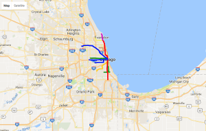


### Overlays

Overalys are objects on the map that are tied to latitude/longitude coordinates, so they move when you drag or zoom the map. 

You need to supply the lat/lon coordinates to the north (lat), south (lat), east (lon) and west (lon) arguments, and a URL to the overlay.


```
google_map(key = "your_api_key") %>%
  add_overlay(north = 40.773941, south = 40.712216, east = -74.12544, west = -74.22655,
               overlay_url = "https://www.lib.utexas.edu/maps/historical/newark_nj_1922.jpg")
```
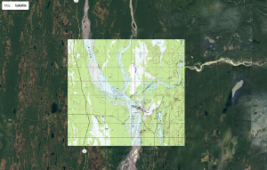


---


## Shiny

As `google_map()` is an `HTMLWidget`, it inherently works in **Shiny**. As with all shiny apps the two functions you need to include are

* `renderGoogle_map()` (in the UI)
* `google_mapOutput()` (in the server)

The simplest app can be built with

```
library(shiny)

ui <- fluidPage(
   google_mapOutput(outputId = "map")
)

server <- function(input, output){

  map_key <- 'your_api_key'

  output$map <- renderGoogle_map({
    google_map(key = map_key)
  })
}

shinyApp(ui, server)

```

But, of course, this isn't very interesting. 

You can use all the standard `add_*` functions that have already been discussed to add various shapes and layers. But there's also various `clear_*` and `update_*` functions that let you update those shapes and layers dynamically within the shiny app. 

The `clear_*` functions are designed to remove objects from the app. 

The `update_*` functions are designed to update those objects that are already on the map. This is useful for when you want to update existing polylines, polygons, rectangles, circles and markers.


```
library(shiny)

ui <- fluidPage(
  sliderInput(inputId = "opacity", label = "opacity", min = 0, max = 1, 
              step = 0.01, value = 1),
  google_mapOutput(outputId = "map")
)

server <- function(input, output){
  
  map_key <- 'your_api_key'
  
  output$map <- renderGoogle_map({
    
    google_map(key = map_key) %>%
      add_polygons(data = melbourne, id = "polygonId", pathId = "pathId", 
                   polyline = "polyline", fill_opacity = 1)
  })
  
  ## observe the opacity slider changing
  observeEvent(input$opacity, {
    
    melbourne$opacity <- input$opacity
    
    google_map_update(map_id = "map") %>%
      update_polygons(data = melbourne, fill_opacity = "opacity", id = "polygonId")
  })
  
}

shinyApp(ui, server)
```

Note that to use the `udpate_*` functions you need to provide the `id` of the object you want to update. 

The exception to the `update_*` functions is `update_heatmap()`, which allows you to both add and remove points from the heat layer.

```
library(shiny)

ui <- fluidPage(
  sliderInput(inputId = "sample", label = "sample", min = 1, max = 10,
              step = 1, value = 10),
  google_mapOutput(outputId = "map")
)

server <- function(input, output){

  #map_key <- 'your_api_key'

  set.seed(20170417)
  df <- tram_route[sample(1:nrow(tram_route), size = 10 * 100, replace = T), ]
  
  output$map <- renderGoogle_map({
    google_map(key = map_key) %>%
      add_heatmap(data = df, lat = "shape_pt_lat", lon = "shape_pt_lon",
                  option_radius = 0.001)
  })

  observeEvent(input$sample,{
    
    df <- tram_route[sample(1:nrow(tram_route), size = input$sample * 100, replace = T), ]

    google_map_update(map_id = "map") %>%
      update_heatmap(data = df, lat = "shape_pt_lat", lon = "shape_pt_lon")
  })
}

shinyApp(ui, server)

```

### Returning Data

One of the more powerful features of `googleway` mapping is the ability to return data from the maps to R using Shiny. 

Data can be returned using 

- clicking on the map
- panning / zooming the map
- shape / layer clicks
- editing shapes
- dragging shapes


Within the `google_map()` call you can pass one of two values to the `event_return_type` argument, "list" or "json". This controls the type of data structure returned back to R from Shiny. 

### Clicking on the map

Data can be retrieved from the map by clicking on it and "observing" the clicks. 

The structure of the observed event is 

- `input$<map_id>_map_click`

where 

- `<map_id>` is the id of the output map element (see example)
- `map_click` is the event being observed


```
library(shiny)
ui <- fluidPage(
 google_mapOutput('myMap')
)
server <- function(input, output){
 output$myMap <- renderGoogle_map({
   google_map(key = "your_api_key", event_return_type = "list")
 })
 observeEvent(input$myMap_map_click, {
    print(input$myMap_map_click)
 })
}
shinyApp(ui, server)
```
Clicking on the map in this example will return the following fields

```
$id
[1] "myMap"

$lat
[1] -37.68382

$lon
[1] 145.08

$centerLat
[1] -37.9

$centerLon
[1] 144.5

$zoom
[1] 8

$randomValue
[1] 0.4043373
```

Similarly, observing `input$myMap_bounds_changed` will observe panning the map, and `input$myMap_zoom_changed` will observe zooming the map.


### Shape / layer clicks

Data can be retrieved from shapes by clicking on them and "observing" the clicks. 

The structure of the observed event is 

- `input$<map_id>_<shape>_click`

where 

- `<map_id>` is the id of the output map element (see example)
- `<shape>` is the shape being clicked (e.g. polygon, polyline, circle, etc)
- `click` is the event being observed

```
library(shiny)
ui <- fluidPage(
 google_mapOutput('map')
)
server <- function(input, output){
 output$map <- renderGoogle_map({
   google_map(key = "your_api_key", event_return_type = "list") %>%
     add_polygons(data = melbourne, polyline = "polyline")
 })
 observeEvent(input$map_polygon_click, {
    print(input$map_polygon_click)
 })
}
shinyApp(ui, server)
```

Clicking on one of the polygons in this example will return the fields

```
$id
[1] 22

$lat
[1] -38.16911

$lon
[1] 144.6872

$outerPath
[1] "dlsgFyduq..." ## truncated

$allPaths
$allPaths[[1]]
[1] "dlsgFyduqZ..." ## truncated


$randomValue
[1] 0.5917599

$layerId
[1] "defaultLayerId"
```

### Editing & Dragging Shapes

The shape layers that have a `editable` argument also return data when the shape is edited.

In this case you would observe `input$<map_id>_<shape>_edited`

Similarly, when shapes are dragged you would observe `input$<map_id>_<shape>_dragged`


